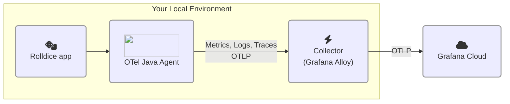

# 1.3. ゼロコード OpenTelemetry

このラボでは、アプリケーションにゼロコード計装を追加する方法を見ていきます。

このステップを完了すると、アーキテクチャは次のようになります。




## ゼロコード計装とは？

OpenTelemetry のドキュメントより:

> ゼロコード計装は、OpenTelemetry API と SDK の機能を、**通常は agent または agent に類する形で**アプリケーションに追加します。具体的な仕組みは言語によって異なり、バイトコード操作、モンキーパッチ、eBPF などを通して OpenTelemetry API や SDK の呼び出しをアプリケーションに注入します。

> 一般的に、**ゼロコード計装は使用中のライブラリに対して計装を追加します。** つまり、計装対象はリクエストとレスポンス、データベース呼び出し、メッセージキュー呼び出しなどです。一方で、通常はアプリケーション自身のコードは計装されません。独自コードを計装するには、コードベースの計装を使用する必要があります。

:::opentelemetry-tip[ゼロコード計装と手動計装、どちらを使うべき？]

自分のアプリケーションに OpenTelemetry を追加する際は、可能であればまず自動（ゼロコード）計装から始めるべきです。ゼロコード計装は、使用しているプログラミング言語の一般的なライブラリやフレームワークを自動で計装するように設計されています。後から必要に応じて、独自コードから追加のテレメトリーを取得するために手動計装を組み合わせることができます。

:::


## ステップ 1: 計装済みアプリケーションを設定して実行する

このステップでは、アプリケーションが OpenTelemetry シグナルを Grafana Cloud の OTLP エンドポイントへ直接送信するように設定します。

次の手順を実行してください。

1.  仮想開発環境を開きます。

1.  プロジェクトの Explorer ペインでプロジェクトツリーを展開し、**ファイル** `source/rolldice/run.sh` **を開きます**。

    :::tip
    
    このファイルが見つからない場合は、最初のラボの「Run the demo app」ステップを実施したか確認してください。そこには必須のセットアップ手順が含まれています。

    :::

1.  サービス用に一意の namespace を考えます。このワークショップでは OpenTelemetry 属性 `service.namespace` を使用し、参加者同士のアプリケーションを区別します。

    例: `johnd` や `cthulhu`。

    ラボ 2 でも同じ名前を使うため、選んだ名前を覚えておいてください。

1.  次に _rolldice_ アプリケーションの run スクリプトを設定し、OpenTelemetry Java agent を追加します。

    `run.sh` ファイルで、最終行（`java -jar ...`）の**直前**に、`<your chosen namespace>` をあなたが選んだ namespace に置き換えて次の行を挿入します。

    ```shell
    export NAMESPACE="<your chosen namespace>"
    export OTEL_RESOURCE_ATTRIBUTES="service.name=rolldice,deployment.environment=lab,service.namespace=${NAMESPACE},service.version=1.0-demo,service.instance.id=${HOSTNAME}:8080"
    export OTEL_EXPORTER_OTLP_PROTOCOL="grpc"
    export OTEL_EXPORTER_OTLP_ENDPOINT="http://localhost:4317"
    ```

    :::warning

    `<your chosen namespace>` を選んだ名前に置き換えていることを確認してください。例:

    `export NAMESPACE="fred"`

    :::

    ここで何が起きているのでしょうか？OpenTelemetry Java agent を設定して、シグナルに次の OpenTelemetry _resource attributes_ を付与しています。

    | リソース属性名 | 値 | 説明 |
    | ------------------ | ----- | ---- |
    | service.name | rolldice | アプリケーションの正規名です |
    | deployment.environment | lab | アプリが動作している環境です。ここでは "lab" を使いますが、実運用では "production"、"test"、"development" などを使うことがあります。 |
    | service.instance.id | （あなたの IDE のホスト名） | この属性値はインスタンスを一意に識別します。アプリのインスタンスが多数ある場合に有用です。このラボ環境では一意で、IDE セッション中に保持される **hostname** を使用します。 |
    | service.namespace | （あなたが選んだ名前） | 同じ **environment** 内で、あなたのアプリケーション群を他と区別できます。複数アプリを実行している場合に、より簡単にグループ化できます。 |

    :::opentelemetry-tip

    OpenTelemetry コンポーネントでは、設定に **environment variables** をよく使用します。`OTEL_EXPORTER_OTLP_ENDPOINT` のデフォルト値は、`localhost` 上の OpenTelemetry collector にテレメトリーを送信することを想定しています。この環境変数は省略可能ですが、ここでは何が起きているかを明確にするため明示しています。
    
    本番環境では、この値を `http://alloy.mycompany.com:4317` など、Alloy インスタンスの場所に設定することがあります。

    :::

1.  `run.sh` ファイルを開いたまま、[OpenTelemetry Java agent](https://opentelemetry.io/docs/zero-code/java/agent/) をアタッチするように**最終行を編集**します。

    ```shell
    java -javaagent:opentelemetry-javaagent.jar -jar ./target/rolldice-0.0.1-SNAPSHOT.jar  
    ```

    Java に慣れていない場合、`-javaagent:` 引数はプログラム起動時に Java プロセスへ agent をアタッチする指定です。agent は、実行中プログラムと相互作用し、内部を検査できる別の Java プログラムです。

1.  次に、新しいターミナル（**Terminal -> New Terminal**）を開いてアプリケーションを再起動します。

    ```shell
    cd source/rolldice

    ./run.sh
    ```

    :::tip

    小さな画面でこのワークショップを進めている場合、ターミナルを別ウィンドウに「ポップアウト」すると見やすくなります。

    その場合は、ターミナル右上の _Move View to Secondary Window_ アイコンをクリックしてください。

    :::

1.  最後に、さらに新しいターミナル（**Terminal -> New Terminal**）を開き、k6 ロードテストを実行してサービスにトラフィックを発生させます。

    ```shell
    cd source/rolldice 

    k6 run loadtest.js
    ```

    ロードテストは開始後、1 時間実行されます。スクリプトはそのまま動かしておきましょう。

    コンソールで進行状況を確認できます。

    ```
    running (0h26m56.8s), 2/2 VUs, 647 complete and 0 interrupted iterations
    default   [================>---------------------] 2 VUs  0h26m56.8s/1h0m0s
    ```

    :::info

    [k6](https://k6.io/) は Grafana のロードテストツールで、サービスへのトラフィックを非常に簡単にシミュレートできます。ここでは _rolldice_ サービスを自動でテストする k6 スクリプト（`loadtest.js`）を用意しているので、手作業を減らせます。

    :::

## ステップ 2: スモークテスト: Trace を見つける

アプリケーションのゼロコード OpenTelemetry 計装を設定し、collector（Grafana Alloy）でシグナルを収集できるようになりました。

ここで、クイックな「スモークテスト」を行って正常に動作しているか確認しましょう。Grafana Cloud で trace を探します。

1.  Grafana Cloud インスタンスにアクセスします。

1.  メインメニューから **Explore** に移動します。

1.  `grafanacloud-xxxxx-traces`（Tempo）データソースを選択します。

1.  **Query type** で **Search** をクリックし、次のフィルターを追加します。

    - **Service Name** ドロップダウンで **rolldice** を選択します。

    - **Tags** セクションで **span** を **resource** に変更します。**service.namespace** タグを選択し、値に **(your chosen namespace)** を入力します。

    **Run query** をクリックします。

1.  Grafana Cloud Traces に _rolldice_ からの OpenTelemetry trace が表示されるはずです。表示される各 trace は、k6 ロードテストスクリプトが生成したリクエストを表しています。

興味があれば trace をさらに掘り下げてみてください。ワークショップの次セクションで、この画面の見方とより多くのシグナルを観測する方法を説明します。

## まとめ

このラボでは、次のことを学びました。

- Java 用 OpenTelemetry agent を使い、コードを 1 行も書かずにアプリを計装する方法。[独自環境で JVM アプリを計装する方法は Grafana Cloud docs を参照してください](https://grafana.com/docs/grafana-cloud/monitor-applications/application-observability/instrument/jvm/)。

- OpenTelemetry Java agent を使って、アプリケーションから trace を自動収集する方法。

- シグナルを OTLP（OpenTelemetry のテレメトリー送信プロトコル）として Grafana Cloud に送信する方法。

- Grafana Explore を使ってアプリケーションの OpenTelemetry trace を表示する方法。

Next をクリックして、このラボのクイズに進んでください。
