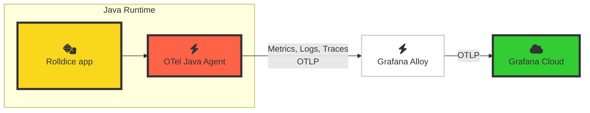

# 2.1. Grafana Cloud で OpenTelemetry を探索する

それでは、Grafana Cloud で OpenTelemetry シグナルを探索していきましょう。

前のラボモジュールを思い出してください。現在のアーキテクチャは次のとおりです。

アプリケーションが Alloy 経由で OpenTelemetry シグナルを Grafana Cloud に送信しているので、Grafana インスタンス内でシグナルを確認できるようになります。

## ステップ 1: Application Observability を探索する

**Grafana Cloud Application Observability** は、アプリケーションを監視し MTTR（平均復旧時間）を最小化するための、すぐに使えるソリューションです。Application Observability は OpenTelemetry と Prometheus をネイティブにサポートし、フロントエンドやインフラ層のデータとアプリケーションテレメトリーを Grafana Cloud 上で統合できます。

Application Observability は、環境内で OpenTelemetry 計装されたアプリケーションを、意図された形で表示します。

1.  Grafana インスタンスにアクセスします。

1.  サイドメニューの **Application** をクリックして _Application Observability_ を開きます。

    :::tip

    キーボードを使う場合は、Ctrl+K（Mac は Cmd+K）で検索バーを開き、"Application" と入力して **Enter** を押します。

    :::

    Application Observability がサービスインベントリで開きます。この画面には、現在 OpenTelemetry trace または trace ベースメトリクスを Grafana Cloud に送信しているすべてのサービスが表示されます。

1.  **Environment** ドロップダウンで既存の選択を **X** ボタンでクリアし、一覧から **lab** を選びます。

    これにより、`lab` 環境で稼働中と報告している OpenTelemetry 計装サービスの一覧が表示されます。

1.  **+ Filter** を押してフィルターを追加します。属性名に **service.namespace** を選び、"value" ドロップダウンから自分の namespace を選択します。

    :::tip

    サービスインベントリに namespace が表示されない場合は数分待ってください。span metric の生成が始まるとアプリケーションが表示されます。

    :::

    :::opentelemetry-tip[セマンティック規約についてひとこと]

    OpenTelemetry は、規約に従うことで最も強力になります。
    
    ここでは OpenTelemetry の _semantic conventions_ の力を使っています。これはテレメトリーシグナルに適用できる、よく知られた標準化済み属性の一覧です。属性を使うことでテレメトリーを柔軟に絞り込み、関心のある特定サービスインスタンスの metrics、logs、traces だけを表示できます。

    `service.namespace` 属性は OpenTelemetry の semantic conventions の一部です。これをサービスの namespace やグルーピングに使えます。そのため、ここで参加者のアプリケーションと区別するフィルターとして非常に有効です。

    また `deployment.environment` 属性も使用しています。これは Grafana Cloud Application Observability の _Environment_ ドロップダウンの値を構成するために使われます。

    OpenTelemetry resource attributes は、使うほど馴染んでいきます。

    :::

1.  サービスインベントリには **rolldice** サービスだけが表示されるはずです。サービスに関する高レベルなメトリクスをすぐ確認できる点に注目してください。

    - Duration (P95)
    - Error Rate
    - Request Rate

    Application Observability に Java のコーヒーカップロゴが表示される点にも注目してください。これは OpenTelemetry 計装がランタイム情報を `telemetry.sdk.language` 属性に保存しているためです。

1.  `rolldice` サービスをクリックして Service View を開きます。

    Service View のタイトルが `<namespace name>/<service name>` となっており、どの namespace を見ているかが明確に示されます。

    Application Observability は、サービスの状態把握に必要な主要統計を即座に表示します。

    

    このビューではアプリケーションの重要なヘルスメトリクスを確認できます。

    - リクエスト遅延（平均、95 パーセンタイル、99 パーセンタイル）

    - エラー率

    - リクエストレート

    :::info[他ソースのメトリクスと併用する Application Observability]

    アプリケーション内の可視化の大半では、Application Observability は trace から生成されたメトリクス（いわゆる _span metrics_）を表示します。デフォルトでは、これらのメトリクスは自動生成されます。
    
    必要であれば OpenTelemetry の [Span Metrics Connector](https://github.com/open-telemetry/opentelemetry-collector-contrib/tree/main/connector/spanmetricsconnector) を使い、ローカルでメトリクスを生成して Grafana Cloud に送信することもできます。
    
    詳細は [see the Application Observability docs](https://grafana.com/docs/grafana-cloud/monitor-applications/application-observability/manual/configure) を参照してください。
    :::

1.  ページを下へスクロールすると、このサービスで呼び出されている操作の一覧と、それぞれの代表的な（P95）遅延・エラー率・リクエストレートが表示されます。

    

## ステップ 2: Traces、Logs、Metrics を探索する

Trace は OpenTelemetry の基盤要素の一つです。Trace によって、システムを内側から観測できます。

OpenTelemetry の計装ライブラリがアプリケーションから trace を生成し、Application Observability で探索できます。

### Traces

1.  _rolldice_ サービス概要から **Traces** タブをクリックします。

1.  traces 一覧で **Trace ID** をクリックすると、trace ビューが並列表示で開きます。

    :::tip

    trace tail の表示領域を広げるには、中央の縦区切りバーをドラッグして左へ移動してください。

    :::

1.  画面右側の trace ビューで "Service & Operation" 見出しの下にある **rolldice** span をクリックし、次を展開します。

    - Span Attributes
    
    - Resource Attributes

    OpenTelemetry agent が自動取得した豊富な属性セットを確認できます。

    

    :::opentelemetry-tip[_span_ 属性と _resource_ 属性を理解する]

    属性はシグナルに付与されるメタデータです。

    - **Span Attributes** は Trace Span に適用され、そのトレース部分に関するメタデータを保持します。この例では span は 1 つで、アプリの HTTP インタラクションを記録しています。`http.route` や `url.query` など、特定リクエストの詳細を観測する属性が見えます。

    - **Resource Attributes** はサービスや実行環境に関するメタデータを保持します。`telemetry.sdk.language`（Java）、`host.name` などを確認できます。

    :::

1.  属性は OpenTelemetry の強力な要素で、サービスに関する問いへの回答を容易にします。

    _span attributes_ を見て、次の質問に答えられるでしょうか？

    - _rolldice_ サービスは URL のクエリ文字列でプレイヤー名を受け取ります。クエリ文字列は URL の `?` 以降の部分で、例: `/myservice?param=value` です。
    
        span attributes からプレイヤー名を見つけられますか？

        

        
答えを見る

        **span attribute** `url.query` を見てください。`player=John` のような値が表示されるはずです。
        

    - サービスが動作しているノードのアーキテクチャは何ですか？
    
      

        
答えを見る

  
        **resource attribute** `host.arch` を見てください。
        
        `amd64` と表示されるはずです。これはこのサービスが 64-bit の x86 ホスト上で動作していることを示します。
      

    - サービスへのリクエストを送ったブラウザー（User-Agent）は何ですか？

      

        
答えを見る

  
        **span attribute** `user_agent.original` を見てください。
        
        `k6/0.53.0 (https://k6.io/)` のような値が含まれるはずです。これは _k6_ がサービスにテストリクエストを送っているためです！
      

### Logs

1.  **Logs** タブをクリックします。

1.  右側で **New Format** ボタンが選択されていることを確認します。

    

    Application Observability は Loki LogQL クエリを作成・実行し、このサービスのログを namespace で絞り込んで検索します。
    
    また、OpenTelemetry 計装によって送信された追加コンテキスト（**scope name**（Java ではクラス名）、ログレベル、trace ID など）も自動で解析・整形します。

    

      
Grafana Cloud は OpenTelemetry ログをどのように処理しますか？

      Grafana Cloud は OpenTelemetry ログに対して次のマッピングを行います。
  
      - `service_name` を決定し、_Loki label_ として使用
      - 他の OpenTelemetry 属性もラベルとして保存。例:
          - deployment.environment（`deployment_environment` になる）
          - service.instance.id（`service_instance_id` になる）
      - 追加の OpenTelemetry 属性は、ログ行に紐づくキー・バリューの _Structured Metadata_ として保存
  
      詳細は [the Loki documentation](https://grafana.com/docs/loki/latest/send-data/otel/) を参照してください。
    

1.  個別のログ行をクリックして展開します。

    Grafana Cloud は `host.name`、`deployment.environment` などの OpenTelemetry _resource attributes_ を、ピリオドをアンダースコアに置換して各ログ行へ付与し、豊富な文脈情報を保持します。
    
    これは障害調査時に非常に有用です。

    

1.  ログから trace への相関もすぐに行えます。

    少し下へスクロールし、_traceID_ の横にある **View trace** ボタンをクリックします。

    

    すると Traces タブに移動し、その特定 trace を表示できます。そこでこのリクエストに関する詳細情報を確認できます。

### ランタイムメトリクスと情報

Trace や Log に加えて、OpenTelemetry の自動計装はアプリケーションに有用なランタイムメトリクスも初期状態で収集します。

これらのメトリクスは、傾向監視や、Trace/Log だけではすぐに見えない問題の特定に役立ちます。

1.  _rolldice_ サービスの Application Observability 画面で **JVM** タブをクリックします。

    Application Observability のこのタブは、計装されたサービスの言語に応じて動的に変わります。この場合は Java アプリで典型的なメトリクスを表示します。

    - CPU 使用率

    - ヒープメモリ使用率

    - その他

    

1.  最後に、画面右上でサービス名近くの **Runtime** ドロップダウンをクリックします。

    OpenTelemetry が取得したランタイム（Java）情報、つまり言語情報を確認できます。

## まとめ

このラボでは次のことを学びました。

- Application Observability で OpenTelemetry 計装済みサービスを探索する

- resource attributes を使って特定サービスのシグナルを絞り込んで表示する

- trace と log を表示し相関させる

- アプリケーションのランタイムメトリクスを表示する

続けるには次のモジュールをクリックしてください。
