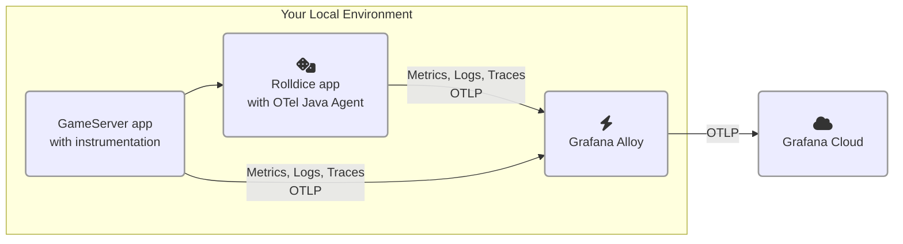

# 2.2. 2つ目のサービスを追加する

このラボでは、OpenTelemetry 計装を使ってアーキテクチャに 2 つ目のサービスを追加します。

このモジュールを完了すると、環境は次のようになります。




## ステップ 1: OpenTelemetry 計装付き Go プログラムを実行する

言語によっては、OpenTelemetry ライブラリやコードをアプリケーションに追加する必要があります。Go はその一例です。

このパートでは、OpenTelemetry ライブラリで計装済みの Go プログラムを実行します。時間短縮のため、計装コードはあらかじめ追加してあります。

このサービスは _gameserver_ と呼ばれます。ユーザーが Computer と最高得点を競うシンプルなゲームを実行します。_gameserver_ サービスは _rolldice_ サービス（ラボ 1）を呼び出してサイコロを 2 回振り、ランダムな値を取得します。各ゲームの勝者は、最も高いスコアを取ったプレイヤーです。

（鋭い方なら、この要件には何か足りない点があることに気づくかもしれません。すぐにわかります！）

それでは _gameserver_ を実行しましょう。

1.  仮想開発環境を開きます。

1.  まず、_rolldice_ の k6 テストがまだ動いている場合は停止します。k6 スクリプトを実行しているターミナルを見つけて **Ctrl+C** で中断し、**ターミナルを閉じて**ください。

1.  新しいターミナル（**Terminal -> New Terminal**）を開き、次を入力して 2 つ目のプロジェクトを永続ワークスペースにコピーし、新しいディレクトリへ移動します。

    ```
     cd source/gameserver
    ```

1.  プロジェクトの Explorer ツリーで `source/gameserver/otel.go` を見つけて開き、コードを確認します。

    :::tip

    独自の Go アプリを計装する場合は、Grafana Cloud ドキュメントの [step-by-step guide][1] を参照してください。

    :::

    `otel.go` には、OpenTelemetry SDK を初期化し、パッケージの自動計装を追加するための _boilerplate code_ が含まれています。traces、logs、metrics の exporter を設定しています。

    他の OpenTelemetry 言語 SDK と同様に、環境変数で設定可能です。次にそれを行います。

1.  このアプリケーションの OpenTelemetry _resource attributes_ を設定します。

    run スクリプト `source/gameserver/run.sh` を開きます。最終行（`go run .`）の**直前**に、`<your chosen namespace>` を前ラボで選んだ同じ namespace に置き換えて、次の行を挿入します。

    ```shell
    export NAMESPACE="<your chosen namespace>" 
    export OTEL_RESOURCE_ATTRIBUTES="service.name=gameserver,deployment.environment=lab,service.namespace=${NAMESPACE},service.version=1.0-demo,service.instance.id=${HOSTNAME}:8090"
    ```

1.  未使用のターミナルで `persisted/gameserver` ディレクトリに移動し、_gameserver_ を実行します。コードのコンパイルが必要なため、起動まで 1〜2 分かかる場合があります。

    ```
    cd source/gameserver

    ./run.sh
    ```

    :::warning[Rolldice should still be running]

    次のコマンドを実行する前に、_gameserver_ アプリが _rolldice_ に依存しているため、_rolldice_ アプリがまだ実行中であることを確認してください。_rolldice_ サービスが停止している場合は、前のラボを参照して実行方法を確認してください。

    :::


1.  最後に、サービスへ負荷をかけてみましょう。

    :::tip

    続行する前に、ラボ 1 の _rolldice_ k6 ロードテストを停止していることを確認してください。停止するには k6 を実行しているターミナルで **Ctrl+C** を押します。

    :::

    新しいターミナルで次のコマンドを実行します。

    ```
    cd source/gameserver

    k6 run loadtest.js
    ```

    _rolldice_ にリクエストが届き始めるはずです。k6 が _gameserver_ にテストリクエストを送信し、_gameserver_ が _rolldice_ を呼び出して乱数を取得します。

このステップの終わりには、次の完全なシステムが動作しているはずです。

- OpenTelemetry collector（Grafana Alloy）

- _rolldice_ アプリケーション（Java）

- _gameserver_ アプリケーション（Go）

- _gameserver_ ロードテストスクリプト（k6）

## ステップ 2: Service Map と Overview を探索する

2 つ目のサービスを計装したので、Service Map でサービス間の相互作用を可視化できるようになります。

1.  Grafana で Application Observability に移動します（サイドメニューの **Application** をクリック）。

1.  フィルターを使ってサービスインベントリを次の条件に絞ります。

    - environment = lab

    - service.namespace = (your chosen namespace)

1.  **Service Map** タブをクリックします。

    指定したフィルターに一致する全サービスとそのメトリクスの可視化が表示されます。この Service Map は span metrics から生成されます。

    :::tip

    サービスインベントリ一覧に両方のサービスが表示されない場合は、span metrics が生成されるまで少し待ってから Refresh ボタンを押してください。

    :::
    
    マップでは、_gameserver_ と _rolldice_ の相互作用の流れを確認できます。また、サービスへの 1 秒あたりリクエスト数も表示されます。

    

1.  マップ内の **gameserver** の円をクリックし、**Service Overview** をクリックします。

    これでこのサービスの健全性を確認できます。_Downstream_ パネルでは、Grafana が下流サービス（ラボ 1 の _rolldice_）を特定していることに注目してください。

    

このサービスはエラーを出しているように見えます。次でそれを確認します。


## ステップ 3: エラーを診断する

サービスで発生しているこれらのエラーを詳しく見ていきましょう。

:::opentelemetry-tip

OpenTelemetry の自動計装は、サービスがエラーを返したことを検出すると、trace に **error** ステータスを付与できます。これによりサービスの失敗リクエストを特定しやすくなります。Grafana Cloud では、相関を使って根本原因を容易に調べられます。

:::

1.  _gameserver_ の Service Overview 画面で **Errors** グラフを見つけ、**Traces** ボタンをクリックしてエラー trace を表示します。

    Application Observability は _Traces_ タブに移動し、選択した時間範囲で `status` が `error` の trace を一覧表示します。

    

    Traces タブでは、すべてのエラー trace を見つけるために次の TraceQL クエリが生成されていることに注目してください。

    ```
    {resource.service.name="gameserver" 
        && resource.deployment.environment=~"lab" 
        && resource.service.namespace="<NAMESPACE>" 
        && status=error}
    ```

    :::opentelemetry-tip

    この TraceQL クエリ内の OpenTelemetry 属性に気づきましたか？このクエリでは属性名の前に `resource.` プレフィックスを付けて、_resource attributes_ を参照しています。
    
    例: `resource.service.namespace`、`resource.service.name`。
    
    :::

1.  trace を見つけて **trace ID をクリック**し、Trace view を開きます。ここから興味深い trace が見えてきます。

    _gameserver_ アプリケーションはゲーム結果を計算するため、ランダム値を取得する目的で _rolldice_ に 2 回呼び出しを行います。

    trace では _rolldice_ サービスへの 2 回の呼び出しが別色で可視化されます。

    

1.  この trace はエラーがあるため表示しました。根本原因を確認しましょう。

    エラーのある span 名を 1 つクリックして trace を展開します。なぜサービスがエラーになったか分かりますか？

    必要であれば **Logs for this span** をクリックして、この span 周辺の関連ログも確認できます。

    **質問: なぜこのサービスはエラーを出していると思いますか？** このラボ末尾のクイズで仮説を確認できます。

1.  エラーを診断したら、trace 情報から次の質問の答えも見つけられるでしょうか。

    - これらの trace の生成に使われた OpenTelemetry 計装ライブラリ（名前とバージョン）は何ですか？

        <details>
        <summary>答えの見つけ方を見る</summary>

        **各 span ヘッダーのテキスト**を見てください。_Library Name_ と _Library Version_ フィールドがあります。例:

        - go.opentelemetry.io/contrib/instrumentation/net/http/otelhttp（Go の HTTP 機能）
        - io.opentelemetry.tomcat-10.0（Java の Tomcat webserver）
        </details>

:::opentelemetry-tip

OpenTelemetry の _instrumentation libraries_ はテレメトリーの基盤です。アプリで使う日常的なライブラリやフレームワークから、span や metrics を生成するなどの役割を担います。

計装ライブラリは、Go ネイティブの `http` パッケージのように、多くのフレームワークやパッケージ向けに提供されています。

:::


## まとめ

このモジュールでは次を学びました。

- OpenTelemetry SDK の典型的な boilerplate code がどのようなものかを見る

- OpenTelemetry tracing 計装済みサービスの Service Map を可視化する

- エラー trace へ移動し、ログと相関して根本原因を見つける

最も重要なのは、collector に追加設定をしなくてもよかった点です。Grafana Alloy はサービスから OTLP シグナルを受信し、自動的に Grafana Cloud へ転送しました。

続けるには次のモジュールをクリックしてください。

[1]: https://grafana.com/docs/grafana-cloud/monitor-applications/application-observability/instrument/go/
