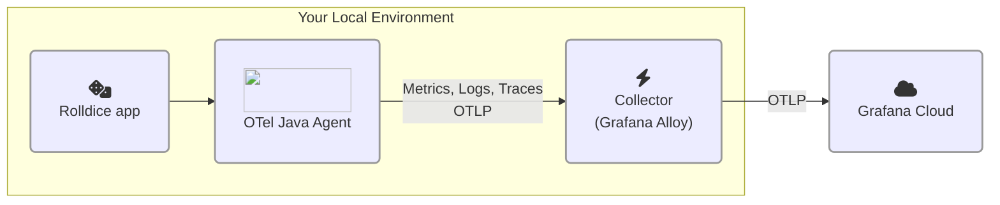

# 1.3. Zero-code OpenTelemetry

이 실습에서는 애플리케이션에 zero-code 계측을 추가하는 방법을 살펴봅니다.

이 단계를 완료하면 아키텍처가 다음과 같이 됩니다:




## Zero-code 계측이란?

OpenTelemetry 문서에서 발췌:

> Zero-code 계측은 일반적으로 에이전트 또는 에이전트 유사 설치로서 애플리케이션에 OpenTelemetry API 및 SDK 기능을 추가합니다. 관련된 구체적인 메커니즘은 언어마다 다를 수 있으며, 바이트코드 조작, 몽키 패칭 또는 eBPF를 사용하여 OpenTelemetry API 및 SDK 호출을 애플리케이션에 주입합니다.

> 일반적으로 **zero-code 계측은 사용 중인 라이브러리를 계측합니다.** 이는 요청과 응답, 데이터베이스 호출, 메시지 큐 호출 등이 계측된다는 것을 의미합니다. 그러나 애플리케이션의 코드 자체는 일반적으로 계측되지 않습니다. 코드를 계측하려면 코드 기반 계측을 사용해야 합니다.

:::opentelemetry-tip[Zero-code 계측을 사용해야 할까요, 수동 계측을 사용해야 할까요?]

자신의 애플리케이션에 OpenTelemetry를 추가할 때는 가능한 경우 자동(zero-code) 계측부터 시작하는 것이 좋습니다. Zero-code 계측은 프로그래밍 언어에서 일반적인 라이브러리와 프레임워크를 자동으로 계측하도록 설계되었습니다. 이후 자신의 코드에서 추가적인 텔레메트리를 캡처해야 할 경우, 수동 계측을 통해 이를 보완할 수 있습니다.

:::


## 1단계: 계측된 애플리케이션 구성 및 실행

이 단계에서는 OpenTelemetry 신호를 Grafana Cloud의 OTLP 엔드포인트로 직접 전송하도록 애플리케이션을 구성합니다.

다음 단계를 완료하세요:

1.  가상 개발 환경을 여세요.

1.  프로젝트 Explorer 패널에서 프로젝트 트리를 확장하고 `source/rolldice/run.sh` 파일을 **열어보세요**.

    :::tip
    
    이 파일이 보이지 않으면 첫 번째 실습에서 "데모 앱 실행" 단계를 따랐는지 확인하세요. 해당 단계에는 몇 가지 필수 설정 단계가 포함되어 있습니다.

    :::

1.  서비스의 고유한 네임스페이스를 정하세요. OpenTelemetry 속성 `service.namespace`를 사용하여 이 워크숍에서 다른 참가자들의 애플리케이션과 자신의 애플리케이션을 구분합니다.

    예를 들어 `johnd` 또는 `cthulhu` 같은 이름을 사용할 수 있습니다.

    선택한 이름을 기억하세요. 실습 2에서도 같은 이름을 사용합니다.

1.  이제 _rolldice_ 애플리케이션의 실행 스크립트에 OpenTelemetry Java 에이전트를 추가하도록 구성합니다.

    `run.sh` 파일에서 마지막 줄(`java -jar ...`) **바로 앞에** 다음 줄을 삽입하세요. `<your chosen namespace>`를 선택한 네임스페이스로 바꾸세요:

    ```shell
    export NAMESPACE="<your chosen namespace>"
    export OTEL_RESOURCE_ATTRIBUTES="service.name=rolldice,deployment.environment=lab,service.namespace=${NAMESPACE},service.version=1.0-demo,service.instance.id=${HOSTNAME}:8080"
    export OTEL_EXPORTER_OTLP_PROTOCOL="grpc"
    export OTEL_EXPORTER_OTLP_ENDPOINT="http://localhost:4317"
    ```

    :::warning

    `<your chosen namespace>`를 선택한 이름으로 반드시 변경하세요. 예:

    `export NAMESPACE="fred"`

    :::

    여기서 무슨 일이 일어나고 있나요? OpenTelemetry Java 에이전트가 신호에 다음과 같은 OpenTelemetry _리소스 속성_을 첨부하도록 구성하고 있습니다:

    | 리소스 속성 이름 | 값 | 설명 |
    | ------------------ | ----- | ---- |
    | service.name | rolldice | 애플리케이션의 공식 이름을 담습니다. |
    | deployment.environment | lab | 앱이 실행되는 환경입니다. 여기서는 "lab"으로 선택했지만, 실제 환경에서는 "production", "test" 또는 "development" 같은 값을 사용할 수 있습니다. |
    | service.instance.id | (IDE의 호스트 이름) | 이 속성의 값은 인스턴스를 고유하게 식별합니다. 앱의 여러 인스턴스가 실행되는 경우 유용합니다. 여기서는 이 실습 환경에서 고유하고 IDE 세션 동안 유지되는 **호스트 이름**을 사용합니다. |
    | service.namespace | (선택한 이름) | 동일한 **환경**에서 다른 사람들의 서비스와 자신의 서비스를 구분할 수 있습니다. 따라서 여러 애플리케이션이 실행 중일 때 더 쉽게 그룹화할 수 있습니다. |

    :::opentelemetry-tip

    OpenTelemetry 구성 요소는 구성을 위해 **환경 변수**를 자주 사용합니다. `OTEL_EXPORTER_OTLP_ENDPOINT`의 기본값은 `localhost`의 OpenTelemetry 컬렉터로 텔레메트리를 전송하도록 설정되어 있습니다. 이 환경 변수를 생략해도 되지만, 여기서는 무슨 일이 일어나는지 명확히 하기 위해 명시적으로 포함했습니다.

    프로덕션 환경에서는 `http://alloy.mycompany.com:4317` 또는 Alloy 인스턴스가 있는 위치로 이 값을 설정할 수 있습니다.

    :::

1.  `run.sh` 파일에서 계속 **마지막 줄을 편집하여** [OpenTelemetry Java 에이전트](https://opentelemetry.io/docs/zero-code/java/agent/)를 첨부하세요:

    ```shell
    java -javaagent:opentelemetry-javaagent.jar -jar ./target/rolldice-0.0.1-SNAPSHOT.jar  
    ```

    Java에 익숙하지 않다면, `-javaagent:` 인수는 프로그램이 시작될 때 Java 프로세스에 에이전트를 첨부하도록 지시합니다. 에이전트는 실행 중인 프로그램과 상호 작용하고 검사할 수 있는 다른 Java 프로그램입니다.

1.  이제 새 터미널을 열고(**Terminal -> New Terminal**) 다음을 입력하여 애플리케이션을 다시 시작하세요:

    ```shell
    cd source/rolldice

    ./run.sh
    ```

    :::tip

    작은 화면에서 이 워크숍을 진행하는 경우, 터미널 창을 "팝아웃"하여 새 브라우저 창으로 만들어 더 넓은 공간을 확보하는 것이 편할 수 있습니다.

    이렇게 하려면 터미널 상단 오른쪽의 _Move View to Secondary Window_ 아이콘을 클릭하세요.

    :::

1.  마지막으로 또 다른 새 터미널을 열고(**Terminal -> New Terminal**), k6 부하 테스트를 실행하여 서비스에 트래픽을 생성하세요:

    ```shell
    cd source/rolldice 

    k6 run loadtest.js
    ```

    부하 테스트가 시작되고 한 시간 동안 실행됩니다. 스크립트를 실행 상태로 두세요.

    콘솔에서 부하 테스트의 진행 상황을 확인할 수 있습니다:

    ```
    running (0h26m56.8s), 2/2 VUs, 647 complete and 0 interrupted iterations
    default   [================>---------------------] 2 VUs  0h26m56.8s/1h0m0s
    ```

    :::info

    [k6](https://k6.io/)는 Grafana의 부하 테스트 도구로, 서비스에 트래픽을 시뮬레이션하기 매우 쉽습니다. _rolldice_ 서비스를 자동으로 테스트하는 k6 스크립트(`loadtest.js`)를 작성해 두었습니다.

    :::

## 2단계: 스모크 테스트: 트레이스 찾기

애플리케이션에 zero-code OpenTelemetry 계측을 구성하고 컬렉터(Grafana Alloy)로 신호를 수집하고 있습니다.

이제 빠른 "스모크 테스트"를 수행하여 모든 것이 정상 작동하는지 확인해 봅시다. Grafana Cloud에서 트레이스를 찾아보겠습니다:

1.  Grafana Cloud 인스턴스로 이동하세요.

1.  메인 메뉴에서 **Explore**로 이동하세요.

1.  `grafanacloud-xxxxx-traces` (Tempo) 데이터 소스를 선택하세요.

1.  **Query type** 옆에서 **Search**를 클릭하세요. 그런 다음 다음 필터를 추가하세요:

    - **Service Name** 드롭다운에서 **rolldice**를 선택하세요.

    - **Tags** 섹션에서 **span**을 **resource**로 변경하세요. **service.namespace** 태그를 선택한 다음 **(선택한 네임스페이스)** 값을 입력하세요.

    **Run query**를 클릭하세요.

1.  Grafana Cloud Traces에서 _rolldice_의 OpenTelemetry 트레이스를 볼 수 있어야 합니다! 표시된 각 트레이스는 k6 부하 테스트 스크립트가 생성한 요청을 나타냅니다.

궁금하시다면 트레이스를 더 자세히 살펴보세요! 워크숍의 다음 섹션에서는 이 화면과 더 많은 신호를 관찰하는 방법을 설명합니다.

## 마무리

이 실습에서 다음을 배웠습니다:

- Java용 OpenTelemetry 에이전트를 사용하여 코드 한 줄 작성 없이 앱을 계측하는 방법. [자신의 환경에서 JVM 애플리케이션을 계측하는 방법에 대한 Grafana Cloud 문서를 참조하세요](https://grafana.com/docs/grafana-cloud/monitor-applications/application-observability/instrument/jvm/).

- OpenTelemetry Java 에이전트를 사용하여 애플리케이션에서 트레이스를 자동으로 수집하는 방법.

- 텔레메트리 전송을 위한 OpenTelemetry 프로토콜인 OTLP로 Grafana Cloud에 신호를 전송하는 방법.

- Grafana Explore를 사용하여 애플리케이션의 OpenTelemetry 트레이스를 보는 방법.

다음을 클릭하여 이 실습의 퀴즈로 이동하세요.
