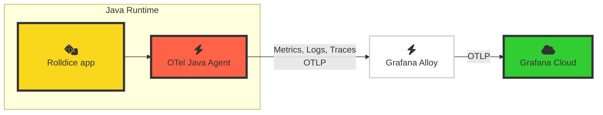

# 2.1. Grafana Cloud에서 OpenTelemetry 탐색

이제 Grafana Cloud에서 OpenTelemetry 신호를 탐색해 봅시다.

지난 실습 모듈에서 기억하시다시피, 현재 아키텍처는 다음과 같습니다:

이제 애플리케이션이 Alloy를 통해 Grafana Cloud로 OpenTelemetry 신호를 전송하기 시작했으므로, Grafana 인스턴스 내에서 신호를 확인할 수 있습니다.

## 1단계: Application Observability 탐색

**Grafana Cloud Application Observability**는 애플리케이션을 모니터링하고 MTTR(평균 복구 시간)을 최소화하는 즉시 사용 가능한 솔루션입니다. Application Observability는 OpenTelemetry와 Prometheus를 모두 기본적으로 지원하며 Grafana Cloud에서 프론트엔드 및 인프라 레이어의 데이터와 함께 애플리케이션 텔레메트리를 결합할 수 있습니다.

Application Observability는 사용 환경의 OpenTelemetry 계측 애플리케이션에 대한 의견이 반영된 뷰를 제공합니다.

1.  Grafana 인스턴스로 이동하세요.

1.  사이드 메뉴에서 **Application**을 클릭하여 _Application Observability_를 여세요.

    :::tip

    키보드를 선호하신다면 Ctrl+K(Mac에서는 Cmd+K)를 눌러 검색 바를 열고 "Application"을 입력한 후 **Enter**를 누르세요.

    :::

    Application Observability가 서비스 인벤토리와 함께 열립니다. 이 뷰는 현재 Grafana Cloud에 OpenTelemetry 트레이스 또는 트레이스 기반 메트릭을 전송하는 모든 서비스를 보여줍니다.

1.  **Environment** 드롭다운에서 기존 항목을 지우고(**X** 버튼 사용) 목록에서 **lab**을 선택하세요.

    이렇게 하면 `lab` 환경에서 실행 중이라고 보고하는 OpenTelemetry 계측 서비스 목록이 표시됩니다.

1.  **+ Filter**를 눌러 필터를 추가하세요. 속성 이름으로 **service.namespace**를 선택하고 "값" 드롭다운에서 목록에서 네임스페이스를 선택하세요.

    :::tip

    서비스 인벤토리에 네임스페이스가 보이지 않으면 몇 분 기다려 주세요. 스팬 메트릭 생성이 시작되면 서비스 인벤토리에 애플리케이션이 나타납니다.

    :::

    :::opentelemetry-tip[시맨틱 컨벤션에 대한 간략한 설명]

    OpenTelemetry는 규칙을 따를 때 가장 강력합니다.

    여기서는 OpenTelemetry의 _시맨틱 컨벤션_의 힘을 활용하고 있습니다. 이는 텔레메트리 신호에 적용할 수 있는 잘 알려진 표준화된 속성 목록입니다. 속성을 통해 텔레메트리를 분류하고 필터링하여 관심 있는 특정 서비스 인스턴스의 메트릭, 로그 및 트레이스만 볼 수 있습니다.

    `service.namespace` 속성은 OpenTelemetry의 시맨틱 컨벤션의 일부입니다. 서비스의 네임스페이스 또는 그룹을 저장하는 데 사용할 수 있습니다. 따라서 같은 실습 참가자들의 애플리케이션과 자신의 애플리케이션을 식별하는 필터로 사용하기에 매우 적합합니다.

    Grafana Cloud Application Observability의 _Environment_ 드롭다운 목록을 채우는 데 사용되는 `deployment.environment` 속성도 사용했습니다.

    OpenTelemetry 리소스 속성을 사용하면서 더 익숙해질 것입니다.

    :::

1.  이제 서비스 인벤토리에 **rolldice** 서비스만 표시됩니다. 서비스에 대한 고수준 메트릭을 즉시 확인할 수 있습니다:

    - 지속 시간 (P95)
    - 오류율
    - 요청율

    Application Observability가 Java 커피컵 로고도 표시한다는 것에 주목하세요. 이는 OpenTelemetry 계측이 `telemetry.sdk.language` 속성에 런타임 정보를 저장하기 때문입니다.

1.  `rolldice` 서비스를 클릭하여 서비스 뷰를 여세요.

    서비스 뷰 제목이 `<네임스페이스 이름>/<서비스 이름>` 형식으로 표시되어 현재 어느 네임스페이스를 보고 있는지 정확히 알 수 있습니다.

    Application Observability는 일반적으로 서비스에 대해 알고 싶은 핵심 통계를 즉시 보여줍니다:

    

    이 뷰에서 애플리케이션의 가장 중요한 상태 메트릭을 확인할 수 있습니다.

    - 요청 지속 시간 - 평균, 95번째 및 99번째 백분위수.

    - 오류율

    - 요청율

    :::info[다른 소스의 메트릭과 함께 Application Observability 사용]

    애플리케이션의 대부분 시각화에서 Application Observability는 트레이스에서 생성된 메트릭(소위 _스팬 메트릭_)을 표시합니다. 기본적으로 Application Observability는 이러한 메트릭을 자동으로 생성합니다.

    원하신다면 OpenTelemetry의 [Span Metrics Connector](https://github.com/open-telemetry/opentelemetry-collector-contrib/tree/main/connector/spanmetricsconnector)를 사용하여 메트릭을 로컬에서 생성하고 Grafana Cloud로 전송할 수도 있습니다.

    자세한 내용은 [Application Observability 문서를 참조하세요](https://grafana.com/docs/grafana-cloud/monitor-applications/application-observability/manual/configure).
    :::

1.  페이지를 스크롤하면 이 서비스에서 호출되는 작업 목록과 일반적인(P95) 지속 시간, 오류 및 요청율을 확인할 수 있습니다:

    

## 2단계: 트레이스, 로그 및 메트릭 탐색

트레이스는 OpenTelemetry의 핵심 구성 요소 중 하나입니다. 트레이스를 통해 시스템 내부를 관찰할 수 있습니다.

OpenTelemetry의 계측 라이브러리는 애플리케이션에서 트레이스를 생성하며, Application Observability에서 탐색할 수 있습니다.

### 트레이스

1.  _rolldice_ 서비스 개요에서 **Traces** 탭을 클릭하세요.

1.  트레이스 목록에서 **Trace ID**를 클릭하여 트레이스 뷰를 나란히 열어보세요.

    :::tip

    트레이스 세부 정보를 위한 공간을 더 확보하려면, 가운데 수직 구분선을 클릭하고 왼쪽으로 드래그하여 뷰를 조정할 수 있습니다.

    :::

1.  화면 오른쪽의 트레이스 뷰에서 "Service & Operation" 제목 아래 **rolldice** 스팬을 클릭한 다음 확장하세요:

    - Span Attributes
    
    - Resource Attributes

    여기서 OpenTelemetry 에이전트에 의해 자동으로 캡처된 풍부한 속성 집합을 볼 수 있습니다.

    

    :::opentelemetry-tip[_스팬_ 및 _리소스_ 속성 이해]

    속성은 신호에 첨부되는 메타데이터 조각입니다:

    - **Span Attributes**는 트레이스 스팬에 적용되며, 트레이스의 이 부분과 관련된 메타데이터를 포함합니다. 이 예에서는 앱의 HTTP 상호 작용을 캡처하는 하나의 스팬만 있습니다. 이 특정 요청의 세부 사항을 관찰하는 데 도움이 되는 `http.route` 및 `url.query` 같은 속성을 볼 수 있습니다.

    - **Resource Attributes**는 서비스와 실행 환경에 대한 메타데이터를 포함합니다. `telemetry.sdk.language`(Java), `host.name` 등과 같은 속성을 확인할 수 있습니다.

    :::

1.  속성은 OpenTelemetry의 강력한 부분으로 서비스에 대한 질문에 더 쉽게 답할 수 있게 해줍니다.

    _스팬 속성_을 보면서 다음 질문에 답할 수 있나요?

    - _rolldice_ 서비스는 URL의 쿼리 문자열에서 플레이어 이름을 받습니다. 쿼리 문자열은 물음표 뒤의 URL 부분입니다(예: `/myservice?param=value`).
    
        스팬 속성에서 플레이어 이름을 찾을 수 있나요?

        

        
답 보기

        **스팬 속성** `url.query`를 확인하세요. `player=John`과 같은 값이 표시될 것입니다.
        

    - 서비스가 실행 중인 노드의 아키텍처는 무엇인가요?
    
      

        
답 보기

  
        **리소스 속성** `host.arch`를 확인하세요.
        
        `amd64`가 표시되어 이 서비스가 64비트 x86 호스트에서 실행 중임을 알 수 있습니다.
      

    - 서비스에 요청을 보낸 브라우저(User-Agent)는 무엇인가요?

      

        
답 보기

  
        **스팬 속성** `user_agent.original`을 확인하세요.
        
        `k6/0.53.0 (https://k6.io/)` 같은 내용이 포함되어 있을 것입니다. 이는 _k6_가 서비스에 테스트 요청을 생성하고 있기 때문입니다!
      

### 로그

1.  **Logs** 탭을 클릭하세요.

1.  오른쪽에서 **New Format** 버튼이 선택되어 있는지 확인하세요.

    

    Application Observability는 이 서비스의 로그를 찾기 위해 Loki LogQL 쿼리를 작성하고 실행하며, 네임스페이스로 범위를 좁힙니다.

    Application Observability는 OpenTelemetry 계측에서 전송된 추가 컨텍스트(예: **스코프 이름**(Java에서는 클래스 이름), 로그 레벨, 트레이스 ID)도 자동으로 파싱하고 형식을 지정합니다.

    

      
Grafana Cloud는 OpenTelemetry 로그를 어떻게 처리하나요?

      Grafana Cloud는 OpenTelemetry 로그에 일부 매핑을 수행합니다:
  
      - `service_name`을 결정하고 _Loki 레이블_로 사용합니다.
      - 일부 다른 OpenTelemetry 속성을 레이블로 저장합니다:
          - deployment.environment (`deployment_environment`로 변환)
          - service.instance.id (`service_instance_id`로 변환)
      - 추가 OpenTelemetry 속성을 로그 라인에 첨부된 키-값 쌍인 _구조화된 메타데이터_로 저장합니다.
  
      자세한 내용은 [Loki 문서를 참조하세요](https://grafana.com/docs/loki/latest/send-data/otel/).
    

1.  개별 로그 라인을 클릭하여 확장하세요.

    Grafana Cloud는 `host.name`, `deployment.environment` 같은 OpenTelemetry _리소스 속성_의 풍부한 값을 캡처하여 각 로그 라인에 첨부하고 점을 밑줄로 대체합니다.

    이는 문제 해결 시 매우 귀중한 컨텍스트를 제공합니다:

    

1.  로그에서 트레이스로 즉시 상관 관계를 맺을 수도 있습니다.

    조금 더 스크롤하여 _traceID_ 옆의 **View trace** 버튼을 클릭하세요.

    

    그러면 Traces 탭으로 이동하여 특정 트레이스를 볼 수 있고, 이 요청에 대한 자세한 정보를 확인할 수 있습니다.

### 런타임 메트릭 및 정보

트레이스와 로그 외에도 OpenTelemetry 자동 계측은 즉시 사용 가능한 애플리케이션의 유용한 런타임 메트릭을 캡처합니다.

이러한 메트릭은 추세를 모니터링하거나 트레이스나 로그에서 즉시 명확하지 않을 수 있는 문제를 식별하는 데 매우 유용할 수 있습니다.

1.  _rolldice_ 서비스의 Application Observability에서 **JVM** 탭을 클릭하세요.

    이 탭은 계측된 서비스의 언어에 따라 동적으로 변경됩니다. 이 경우 Java 애플리케이션에 일반적인 메트릭을 표시합니다:

    - CPU 사용률

    - 힙 메모리 사용률

    등.

    

1.  마지막으로 화면 오른쪽 상단의 서비스 이름 근처에 있는 **Runtime** 드롭다운을 클릭하세요.

    OpenTelemetry에 의해 캡처된 런타임(Java) 정보(즉, 언어)를 확인할 수 있습니다.

## 마무리

이 실습에서 다음을 배웠습니다:

- Application Observability에서 OpenTelemetry 계측 서비스 탐색

- 리소스 속성을 사용하여 특정 서비스의 신호를 좁혀 보는 방법

- 트레이스와 로그 간 상관 관계 확인

- 애플리케이션에서 런타임 메트릭 보기

다음 모듈로 계속 진행하세요.
