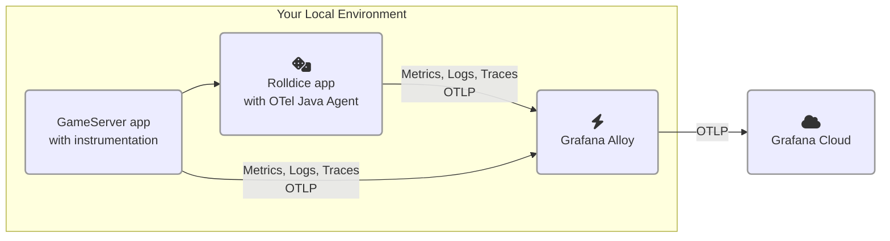

# 2.2. 두 번째 서비스 추가

이 실습에서는 OpenTelemetry 계측과 함께 아키텍처에 두 번째 서비스를 추가합니다.

이 모듈을 완료하면 환경이 다음과 같이 됩니다:




## 1단계: OpenTelemetry 계측이 포함된 Go 프로그램 실행

일부 언어는 애플리케이션에 OpenTelemetry 라이브러리나 코드를 추가해야 합니다. Go는 이러한 접근 방식을 사용하는 언어 중 하나입니다.

이 워크숍 부분에서는 OpenTelemetry 라이브러리로 계측된 Go 프로그램을 실행합니다. 시간을 절약하기 위해 계측 코드는 이미 추가되어 있습니다.

이 서비스는 _gameserver_라고 합니다. 사용자가 컴퓨터와 경쟁하여 최고 점수를 얻는 간단한 게임을 실행합니다. _gameserver_ 서비스는 주사위를 두 번 굴리기 위해 _rolldice_ 서비스(Lab 1에서)를 호출합니다. 각 게임의 승자는 가장 높은 점수를 얻은 플레이어입니다.

(눈치 빠른 분들은 이 요구사항에 무언가 빠져 있다는 것을 알아챌 수 있습니다. 곧 알게 될 것입니다!)

_gameserver_를 실행해 봅시다:

1.  가상 개발 환경을 여세요.

1.  먼저, _rolldice_ k6 테스트가 아직 실행 중이라면 중지하세요: k6 스크립트가 실행 중인 터미널을 찾아 **Ctrl+C**를 눌러 테스트를 중단한 다음 **터미널을 닫으세요**.

1.  새 터미널을 열고(**Terminal -> New Terminal**) 다음을 입력하여 두 번째 프로젝트를 영구 작업 공간으로 복사하고 새 디렉토리로 이동하세요:

    ```
     cd source/gameserver
    ```

1.  프로젝트 Explorer 트리에서 `source/gameserver/otel.go` 파일을 찾아 열어 코드를 검사하세요.

    :::tip

    자신의 Go 애플리케이션을 계측할 계획이라면, [Grafana Cloud 문서의 단계별 가이드][1]를 따를 수 있습니다.

    :::

    `otel.go` 안에는 OpenTelemetry SDK를 초기화하고 패키지의 자동 계측을 추가하는 _보일러플레이트 코드_가 있습니다. 트레이스, 로그 및 메트릭 내보내기를 설정합니다.

    다른 OpenTelemetry 언어 SDK와 마찬가지로 환경 변수로 구성할 수 있으며, 다음에 이를 수행합니다.

1.  이 애플리케이션의 OpenTelemetry _리소스 속성_을 설정해 봅시다.

    실행 스크립트 `source/gameserver/run.sh`를 열어보세요. 마지막 줄(`go run .`) **바로 앞에** 다음 줄을 삽입하세요. `<your chosen namespace>`를 이전 실습에서 선택한 네임스페이스로 바꾸세요:

    ```shell
    export NAMESPACE="<your chosen namespace>" 
    export OTEL_RESOURCE_ATTRIBUTES="service.name=gameserver,deployment.environment=lab,service.namespace=${NAMESPACE},service.version=1.0-demo,service.instance.id=${HOSTNAME}:8090"
    ```

1.  사용하지 않는 터미널에서 `persisted/gameserver` 디렉토리로 이동하고 _gameserver_를 실행하세요. 코드를 컴파일해야 하므로 시작하는 데 1~2분이 걸릴 수 있습니다:

    ```
    cd source/gameserver

    ./run.sh
    ```

    :::warning[Rolldice가 여전히 실행 중이어야 합니다]

    _gameserver_ 앱은 _rolldice_에 의존하기 때문에, 다음 명령을 실행하기 전에 _rolldice_ 애플리케이션이 여전히 실행 중인지 확인하세요. _rolldice_ 서비스가 중지된 경우, 이전 실습으로 돌아가 실행 방법을 확인하세요.

    :::


1.  마지막으로 서비스에 부하를 생성해 봅시다.

    :::tip

    계속하기 전에 Lab 1에서 _rolldice_ k6 부하 테스트를 중지했는지 확인하세요. 부하 테스트를 중지하려면 k6가 실행 중인 터미널을 찾아 **Ctrl+C**를 누르세요.

    :::

    새 터미널에서 다음 명령을 실행하세요:

    ```
    cd source/gameserver

    k6 run loadtest.js
    ```

    _rolldice_로 일부 요청이 도착하는 것을 볼 수 있습니다. k6는 _gameserver_에 테스트 요청을 보내고, 이는 다시 _rolldice_를 호출하여 랜덤 숫자를 받습니다.

이 단계의 끝에서 전체 시스템이 실행 중이어야 합니다:

- OpenTelemetry 컬렉터 (Grafana Alloy)

- _rolldice_ 애플리케이션 (Java)

- _gameserver_ 애플리케이션 (Go)

- _gameserver_ 부하 테스트 스크립트 (k6)

## 2단계: 서비스 맵 및 개요 탐색

두 번째 서비스를 계측했으므로 서비스 맵에서 이러한 서비스 간의 상호 작용을 시각화할 수 있습니다.

1.  Grafana에서 Application Observability로 이동하세요 (사이드 메뉴에서 **Application** 클릭).

1.  필터를 사용하여 서비스 인벤토리를 좁히세요:

    - environment = lab

    - service.namespace = (선택한 네임스페이스)

1.  **Service Map** 탭을 클릭하세요.

    이제 주어진 필터에 맞는 모든 서비스와 그 메트릭을 단일 뷰에서 시각화할 수 있습니다. 이 서비스 맵은 스팬 메트릭에서 생성됩니다.

    :::tip

    서비스 인벤토리 목록에 두 서비스가 모두 표시되지 않으면 스팬 메트릭이 생성될 때까지 잠시 기다리세요. 그런 다음 새로 고침 버튼을 클릭하세요.

    :::
    
    맵에서 _gameserver_와 _rolldice_ 간의 상호 작용 흐름을 볼 수 있습니다. 서비스에 대한 초당 요청 수도 볼 수 있습니다:

    

1.  맵에서 **gameserver** 원을 클릭한 다음 **Service Overview**를 클릭하세요.

    이제 이 서비스의 상태를 볼 수 있습니다. _Downstream_ 패널에서 Grafana가 다운스트림 서비스(Lab 1의 _rolldice_)를 식별했음을 확인하세요.

    

서비스가 일부 오류를 던지고 있다는 것을 알 수 있습니다. 다음에 이를 살펴보겠습니다.


## 3단계: 오류 진단

서비스가 경험하고 있는 이러한 오류를 확대해 봅시다.

:::opentelemetry-tip

OpenTelemetry 자동 계측은 서비스에서 오류가 반환되는 것을 감지하면 트레이스를 **error** 상태로 표시할 수 있습니다. 이렇게 하면 서비스에 대한 실패한 요청을 훨씬 쉽게 식별할 수 있습니다. Grafana Cloud에서는 근본 원인을 찾기 위해 쉽게 연관 지을 수 있습니다.

:::

1.  _gameserver_의 서비스 개요 화면에서 **Errors** 그래프를 찾아 **Traces** 버튼을 클릭하여 오류 트레이스를 표시하세요.

    Application Observability는 _Traces_ 탭으로 이동하여 선택한 시간 프레임에서 `status`가 `error`로 표시된 트레이스를 나열합니다.

    

    Traces 탭이 모든 오류 트레이스를 찾기 위해 다음 TraceQL 쿼리를 생성했다는 것에 주목하세요:

    ```
    {resource.service.name="gameserver" 
        && resource.deployment.environment=~"lab" 
        && resource.service.namespace="<NAMESPACE>" 
        && status=error}
    ```

    :::opentelemetry-tip

    이 TraceQL 쿼리에서 OpenTelemetry 속성을 발견했나요? 이 쿼리에서는 속성 이름에 `resource.` 접두사를 추가하여 _리소스 속성_을 참조합니다.

    예: `resource.service.namespace`, `resource.service.name`.

    :::

1.  트레이스를 찾아 **트레이스 ID를 클릭**하여 트레이스 뷰를 여세요. 이제 흥미로운 트레이스가 보이기 시작합니다!

    _gameserver_ 애플리케이션은 게임 결과를 계산하기 위해 _rolldice_를 두 번 호출하여 랜덤 숫자를 가져옵니다.

    트레이스는 _rolldice_ 서비스에 대한 두 번의 호출을 다른 색상으로 시각화합니다:

    

1.  이 트레이스를 본 것은 오류가 있었기 때문입니다. 근본 원인을 찾아봅시다.

    오류가 있는 스팬 이름 중 하나를 클릭하여 트레이스를 확장하세요. 서비스가 오류를 던진 이유를 찾을 수 있나요?

    이 스팬 주변의 로그를 보려면 **Logs for this span**을 클릭할 수도 있습니다.

    **질문: 왜 이 서비스가 오류를 던지고 있다고 생각하나요?** 이 실습 끝의 퀴즈에서 가설을 확인할 수 있습니다.

1.  오류를 진단한 후, 트레이스 정보를 사용하여 다음 질문에 답할 수 있나요:

    - 이 트레이스를 생성하는 데 사용된 OpenTelemetry 계측 라이브러리(이름과 버전)는 무엇인가요?

        <details>
        <summary>답을 찾는 방법 보기</summary>

        **각 스팬 헤더의 텍스트**를 확인하세요. _Library Name_ 및 _Library Version_ 필드가 있어야 합니다. 예:

        - go.opentelemetry.io/contrib/instrumentation/net/http/otelhttp (Go의 HTTP 기능)
        - io.opentelemetry.tomcat-10.0 (Java의 Tomcat 웹서버)
        </details>

:::opentelemetry-tip

OpenTelemetry의 _계측 라이브러리_는 텔레메트리의 기반을 마련합니다. 앱에서 사용하는 일상적인 라이브러리와 프레임워크에서 스팬과 메트릭을 생성하는 등의 작업을 수행합니다.

계측 라이브러리는 Go의 기본 `http` 패키지 같은 다양한 프레임워크와 패키지에 사용할 수 있습니다.

:::


## 마무리

이 모듈에서 다음을 배웠습니다:

- 일반적인 OpenTelemetry SDK 보일러플레이트 코드가 어떻게 생겼는지 확인

- OpenTelemetry 트레이스 계측 서비스의 서비스 맵 시각화

- 오류 트레이스로 이동하고 로그와 연관하여 근본 원인 찾기

가장 중요한 점은 컬렉터에 추가 구성을 추가할 필요가 없었다는 것입니다. Grafana Alloy는 서비스에서 OTLP 신호를 받아 Grafana Cloud로 자동으로 전달했습니다.

다음 모듈로 계속 진행하세요.

[1]: https://grafana.com/docs/grafana-cloud/monitor-applications/application-observability/instrument/go/
